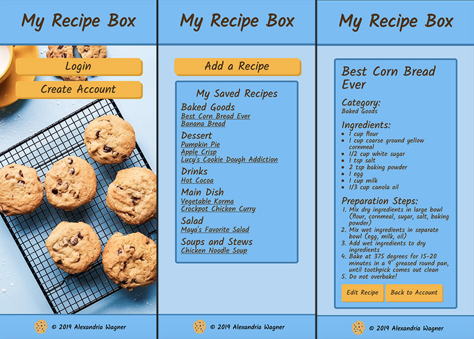

# my-recipe-box

I made this app to solve the problem of 200+ unused and disorganized paper recipes that sit in my recipe box in my kitchen. This is a full-stack app to catalog your recipes so you have easy and organized access to them on your phone or computer.

Create an account by entering your email and choosing a password. After you log in, you'll be brought to your main account page, which displays all of your saved recipes by category. To save a recipe, click on the Add a Recipe button. Enter the recipe name, choose a category, and then list the ingredients and steps. You can also edit your saved recipes.

## Technologies Used
- [MySQL](https://www.npmjs.com/package/mysql)
- [Express](https://www.npmjs.com/package/express)
- [React](https://www.npmjs.com/package/react)
- [Node](https://nodejs.org/en/)
- [Babel](https://www.npmjs.com/package/@babel/core)
- [BCrypt](https://www.npmjs.com/package/bcrypt)
- [Passport](http://www.passportjs.org/)